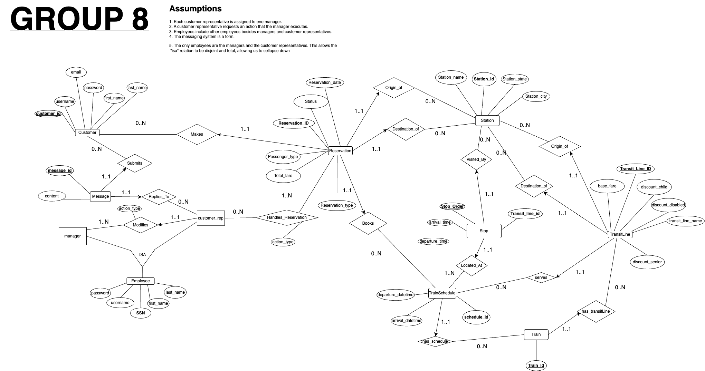
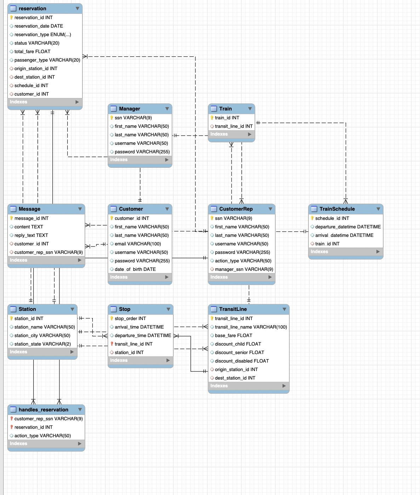

# Train Reservation Management System  
### Final Project – Rutgers University CS336 (Database Systems)  

This project is a full-stack web application that simulates a complete train reservation system with separate roles for **Customers**, **Customer Representatives**, and **Administrators**.  
It was built using **Java Servlets, JSP, JDBC, and MySQL**, deployed on **Apache Tomcat 10** under the Jakarta EE specification.

The system supports account management, trip searching, reservations, customer service messaging, schedule management, and admin analytics — following an MVC-style structure where **Servlets act as controllers** and **JSPs render views**.

---

## Demo Video
A full walkthrough demonstrating login, searching, reserving, schedule management, admin dashboards, and customer messaging is included with the project.

**Video link here:**  

---

## Features Overview

### Customer Features
- Create an account & login  
- Search available train schedules  
- Reserve one-way or round-trip tickets  
- View & cancel reservations  
- Submit questions to customer service  
- View replies from representatives  

---

### Customer Representative (Employee) Features
- Login using employee credentials  
- Manage train schedules (Add, Edit, Delete)  
- View and reply to customer questions  
- Search customers by transit line and reservation date  

---

### Admin Features
- Login as admin  
- Manage customer representatives (Add, Edit, Delete)  
- View analytics:
  - Best customers  
  - Revenue by customer  
  - Revenue by line  
  - Monthly sales  
  - Top transit lines  

---

## Technical Stack

| Layer | Technology |
|-------|------------|
| Frontend | JSP, HTML, CSS |
| Backend | Java Servlets (Jakarta EE 10) |
| Database | MySQL 8 + JDBC |
| Server | Apache Tomcat 10 |
| Architecture | MVC (Servlets → JSP views) |

## Database Schema

This project uses **MySQL+** with the schema defined in two files included in the `/database` folder:

### **1️⃣ schema.sql**
Creates all tables:

- Customer  
- CustomerRep  
- Manager  
- Train  
- TransitLine  
- Station  
- Stop  
- TrainSchedule  
- Reservation  
- Message  
- handles_reservation
  
## Entity–Relationship Diagrams

### Team-Designed ERD

### MySQL-Generated ERD

